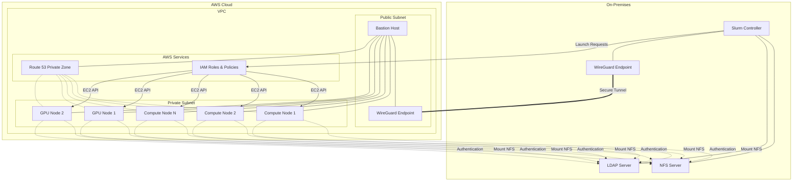

# HPC Bursting Demo: Local to AWS

This repository contains scripts and configuration for creating a hybrid HPC environment that bursts from a local machine to AWS when needed.

## Overview

This project demonstrates how to set up an on-premises HPC environment with the capability to burst to the AWS cloud when demand exceeds local capacity. It includes:

- Local HPC system with Slurm, LDAP, and NFS
- AWS infrastructure with VPC, bastion host, and Route 53
- WireGuard VPN tunnel for secure connectivity
- Slurm AWS Plugin for cloud bursting
- Support for CPU and GPU workloads

## Architecture

## Prerequisites

- Rocky Linux 9 VM with basic installation
- AWS account with appropriate permissions
- Internet connectivity for the VM

## Repository Structure

- `scripts/` - Setup scripts for local and AWS systems
- `config/` - Configuration templates
- `examples/` - Example jobs and workflows
- `docs/` - Documentation and guides
- `ansible/` - Ansible playbooks for automated deployment

## Getting Started

See the [Installation Guide](docs/installation.md) for detailed setup instructions.

## License

This project is licensed under the MIT License - see the LICENSE file for details. 

