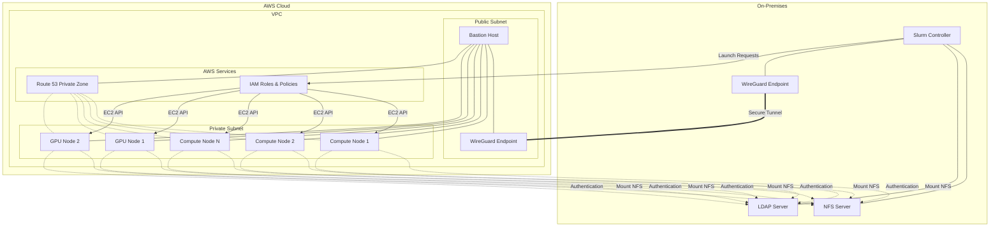

# HPC Bursting Demo: Local VM to AWS

This repository contains scripts and configuration for creating a hybrid HPC environment that bursts from a local virtual machine to AWS.

## Overview

This project demonstrates how to set up an "on-premises" HPC environment with the capability to burst to the AWS cloud. It includes:

- Local VM HPC system with Slurm, LDAP, and NFS
- AWS infrastructure with VPC, bastion host, and Route 53
- WireGuard VPN tunnel for secure connectivity
- Slurm AWS Plugin v2 for cloud bursting
- Support for CPU and GPU workloads

## Architecture



## Prerequisites

- Rocky Linux 9 VM minimal with basic installation and one local user with sudo privileges.
- AWS account with appropriate permissions
- Internet connectivity for the VM

## Repository Structure

- `scripts/` - Setup scripts for local and AWS systems
- `config/` - Configuration templates
- `examples/` - Example jobs and workflows
- `docs/` - Documentation and guides
- `ansible/` - Ansible playbook for automated local deployment
- `cloudformation/` - Cloudformation template for automated AWS deployment

## Getting Started

See the [Installation Guide](docs/installation.md) for detailed setup instructions.

## Ansible Deployment

For automated deployment of the local HPC system, you can use the provided Ansible playbook:

### Prerequisites

1. Install Ansible on your control machine (which could be the local VM):
   ```bash
   # On RHEL/Rocky/Fedora
   sudo dnf install -y ansible
   
   # On Debian/Ubuntu
   sudo apt update
   sudo apt install -y ansible
   
   # Or via pip
   pip install ansible

2. If you are not using the local VM - set up SSH access to your target Rocky 9 VM

### Configuration

1. Create an inventory file for your environment:

   ```bash
   cat > inventory.ini << EOF
   [hpc_local]
   your-vm-ip-address
   
   [hpc_local:vars]
   ansible_user=your-username
   ansible_ssh_private_key_file=/path/to/your/private/key
   # Optional AWS parameters if you've already created AWS resources
   aws_region=us-west-2
   private_subnet_id=subnet-xxxxxxxx
   compute_security_group_id=sg-xxxxxxxx
   [hpc_local:vars]
   ansible_user=your-username
   ansible_ssh_private_key_file=/path/to/your/private/key
   # Optional AWS parameters if you've already created AWS resources
   aws_region=us-west-2
   private_subnet_id=subnet-xxxxxxxx
   compute_security_group_id=sg-xxxxxxxx
   # Optional accelerator parameters
   gpu_launch_template_id=lt-xxxxxxxx
   inferentia_launch_template_id=lt-xxxxxxxx
   trainium_launch_template_id=lt-xxxxxxxx
   EOF
   ```

2. Review and customize the Ansible variables:

- `hostname`: Hostname for your local system
- `ldap_admin_password`: Password for LDAP admin
- `mysql_slurm_password`: Password for Slurm database
- `aws_region`: AWS region for bursting
- `subnet_id`: AWS subnet ID for compute nodes
- `compute_sg_id`: Security group ID for compute nodes

### Running the Playbook

1. Run the Ansible playbook:

   ```bash
   ansible-playbook -i inventory.ini hpc_bursting_local_setup.yml
   ```

2. The playbook will:

   - Update the system
   - Set up NFS server
   - Configure LDAP authentication
   - Install and configure Slurm
   - Set up WireGuard
   - Configure AWS Plugin for Slurm v2
   - Configure centralized logging

### Post-Installation

After the Ansible playbook completes:

1. Configure AWS CLI with your credentials:

```
aws configure
```

2. Set up the AWS infrastructure using one of these methods:

   Option A: Step-by-step AWS setup

```
cd scripts/aws
./setup_aws_infra.sh
```

​	Option B: CloudFormation deployment

```
# After creating AMIs with Option A or manually
./create_cf_parameters.sh
aws cloudformation create-stack --stack-name hpc-bursting-demo \
  --template-body file://../../cloudformation/hpc-bursting-infrastructure.yaml \
  --parameters file://../../cloudformation/ami-parameters.json \
  --capabilities CAPABILITY_IAM
```

3. Once the AWS infrastructure is set up, WireGuard will be automatically configured for the bastion connection.

4. Test the bursting capability:

```
./test_bursting.sh
```


## CloudFormation Deployment

For AWS-native deployment, you can use the included CloudFormation template with the AMIs created in the previous steps:

### Prerequisites
- Complete the AMI creation steps (running `setup_aws_infra.sh` or at least the `04_create_amis.sh` script)
- AWS CLI configured with appropriate permissions

### Deployment Steps

1. Generate CloudFormation parameters file from your created AMIs:
```bash
cd scripts/aws
./create_cf_parameters.sh
```
2. Deploy the CloudFormation stack:

```bash
aws cloudformation create-stack \
  --stack-name hpc-bursting-demo \
  --template-body file://../../cloudformation/hpc-bursting-infrastructure.yaml \
  --parameters file://../../cloudformation/ami-parameters.json \
  --capabilities CAPABILITY_IAM \
  --region us-west-2
```
3. Monitor stack creation:

```bash
aws cloudformation describe-stacks --stack-name hpc-bursting-demo
```
4. Once the stack is complete, retrieve the outputs:

```bash
aws cloudformation describe-stacks \
  --stack-name hpc-bursting-demo \
  --query 'Stacks[0].Outputs' \
  --output table
```
5. Update your local WireGuard configuration with the bastion host's public IP:

```bash
BASTION_PUBLIC_IP=$(aws cloudformation describe-stacks \
  --stack-name hpc-bursting-demo \
  --query 'Stacks[0].Outputs[?OutputKey==`BastionPublicIP`].OutputValue' \
  --output text)

# Get the bastion's WireGuard public key
BASTION_PUBLIC_KEY=$(ssh -i hpc-demo-key.pem rocky@$BASTION_PUBLIC_IP "cat /etc/wireguard/publickey")

# Update your local WireGuard configuration
cat << WIREGUARD | sudo tee -a /etc/wireguard/wg0.conf
[Peer]
PublicKey = $BASTION_PUBLIC_KEY
AllowedIPs = 10.0.0.2/32, 10.1.0.0/16
Endpoint = $BASTION_PUBLIC_IP:51820
PersistentKeepalive = 25
WIREGUARD

sudo systemctl restart wg-quick@wg0
```
6. Update the Slurm AWS plugin configuration with the CloudFormation outputs:

```bash
cd scripts/aws
./update_slurm_from_cloudformation.sh hpc-bursting-demo
```

7. Clean Up

   To delete the CloudFormation stack when you're done:

```bash
aws cloudformation delete-stack --stack-name hpc-bursting-demo
```
This provides a clean approach to integrating your existing AMI creation script with CloudFormation, and gives users clear instructions on how to use the CloudFormation-based deployment method.

## License

This project is licensed under the MIT License - see the LICENSE file for details. 

